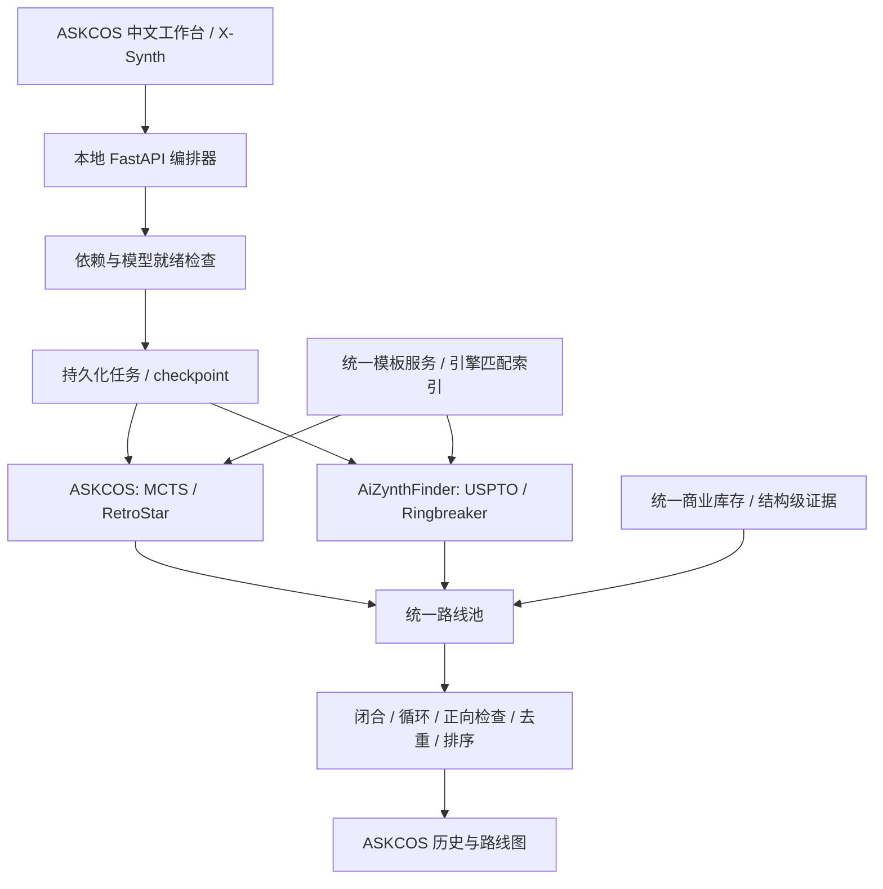

# X-Synth

X-Synth 合成研究平台，以 ASKCOS 为主程序和中文工作台，使用 ASKCOS 与
AiZynthFinder 搜索路线，通过统一路线池完成结构规范化、商购闭合检查、
去重、评分与历史回写。没有接入 LLM 推理或审查，不需要 Codex 登录凭据。

## 运行边界

当前为开发版本，不是已完成完整运行验收的生产发布。源码、模型、模板、
商业库存和任务数据是不同的交付对象：安装 Python 包或打开页面，不代表
模型和商业库存已经就绪。缺少搜索后端时，API 返回 503，不创建失败占位任务。

仓库不附带模型权重、化学数据库、供应商导出、数据库备份、私人任务或凭据。
ASKCOS 原生模型、其模板索引、Mongo 库和 AiZynthFinder 库存需要单独配置。
模型对应的模板索引必须保持一致，不能把任意合并模板库替换到已训练模型下。

## 架构



## 安装

编排器验证环境为 Linux / WSL、Python 3.12、Node.js 24，Docker Compose v2。
建议在 WSL 的 Linux 文件系统内安装依赖，不在 Windows 挂载目录构建模型环境。

```bash
git clone https://github.com/Victor-Xu-1/X-Synth.git
cd X-Synth
python3 -m venv .venv
.venv/bin/python -m pip install --require-hashes -r requirements/orchestrator-linux-py312.lock
.venv/bin/python -m pip install --no-deps .
```

AiZynthFinder 使用独立环境，因为它与主程序的 RDKit 版本要求不同：

```bash
python3 -m venv /srv/wsl/envs/x-synth-aizynthfinder
/srv/wsl/envs/x-synth-aizynthfinder/bin/python -m pip install -r requirements/aizynthfinder-linux-py312.lock
export SYNON_AIZYNTH_PYTHON=/srv/wsl/envs/x-synth-aizynthfinder/bin/python
```

模型与 stock 的配置见 `engines/aizynthfinder/models/`。配置中的资源路径相对
于该 YAML 文件所在目录解析；合并后的运行配置使用绝对路径，不依赖旧账户
目录或启动时的工作目录。供应商、模板数据的
导入工具位于 `scripts/data_import/`。不得使用空文件或测试 stock 代替真实索引。

Python 锁文件以 Linux / Python 3.12 为基准。主程序锁由 pip-tools 7.6.1
生成并包含包哈希；AiZynthFinder 锁由已验证环境的 `python -m pip freeze`
生成，固定完整依赖版本。更新时分别使用各自环境，不从全局 Python 导出。
前端以 `package-lock.json` 和 `npm ci` 为依赖权威。主程序与 AiZynthFinder
是两个独立的 Python 构建边界，禁止在同一个环境中混装它们的 RDKit。
结构编辑使用项目内的 Ketcher/Indigo 资源；路线提交仍在后端执行结构校验、
商业闭合和路线审查。

## 启动与构建

编排器默认只监听本机地址：

```bash
.venv/bin/python -m uvicorn apps.synon_orchestrator.app:app --host 127.0.0.1 --port 8790
```

前端沿用 ASKCOS 原 UI，不创建第二套界面：

```bash
cd apps/askcos-v2/askcos-vue-nginx/askcos_vue
npm ci
npm run dev -- --host 127.0.0.1 --port 8769
npm run build
```

工作台地址为 `http://127.0.0.1:8769/`，API 为 `http://127.0.0.1:8790/`。
前端默认代理到本机 ASKCOS 9100 和编排器 8790，不会使用外部演示服务器。
完整 ASKCOS 容器部署的入口为 `apps/askcos-v2/askcos2_core/compose.yaml`；
启动前需要私有 `.env`、nginx 运行配置、匹配的模型资源和已初始化的数据库。
该 Compose 栈不能在缺少这些资产时被视为已经可用于路线任务。

## 验证

```bash
.venv/bin/python -m pytest tests/unit
cd apps/askcos-v2/askcos-vue-nginx/askcos_vue
npm test -- --runInBand
npm run build
```

`test_frontend_backend_contract.py` 使用实际 Node 前端函数和后端 Pydantic
模型校验默认请求，而不是只断言两份常量。运行 Python 回归测试时，Node
必须在 PATH 中，或设置 `SYNON_TEST_NODE` 为它的可执行文件。

部分历史集成测试依赖未包含在本仓库的真实引擎结果 fixture。缺少 fixture
属于未完成验收，不能删除校验或填入模拟路线来宣称通过；必须补齐真实
来源的结果后再进行完整路线验收。搜索结果也必须经过人工化学可行性检查。
GitHub CI 保留完整单元测试门禁；这些缺失资源的失败不会被跳过或伪装通过。

当前依赖安全审计仍存在遗留漏洞，包括旧 CAS OIDC 客户端和前端工具链。
兼容范围内的自动修复未能消除这些问题，不能通过强制降级登录库宣称已修好。
在完成安全升级、真实登录回归及完整搜索验收前，只能作为本机开发版本使用。

## 故障检查

- 页面可打开但任务不能开始：检查 `/synon-api/health` 的
  `route_search_ready`、`service_checks` 与 `dependency_errors`。
- 422：前后端字段或参数范围不一致。默认请求契约回归应首先通过。
- AiZynthFinder 找不到文件：检查模型配置、`SYNON_AIZYNTH_PYTHON`、
  `SYNON_AIZYNTH_STOCK_CONFIG` 和相对路径的基准目录。
- 路线存在但历史为空：检查最终 Mongo 回写，不应仅凭本地 summary 标成成功。
- WSL 调用偶发连接超时：调用时显式指定 `wsl --cd <Linux 项目路径>`；
  不要为此关闭整个 WSL 或停止无关项目。

## 许可证与安全

自研代码采用 Apache-2.0，见 `LICENSE`。第三方代码保留原协议，见 `NOTICE`
及各组件的许可证。Reaxys 等模型许可不是源码许可，商业数据库与供应商
数据的使用及再分发权需要分别确认。

当前只用于本机工作台，未经独立鉴权与安全验收，不应暴露到公网。
不得提交 `.env`、令牌、私有会话、数据库卷或恢复证据包。

源码更新失败时可以切回之前的 Git revision 并重新安装、构建；数据目录和
模型资源独立于源码，不随源码发布覆盖。没有通过完整验证的版本不应打生产
发布标签，也不应执行不可逆数据库迁移。
