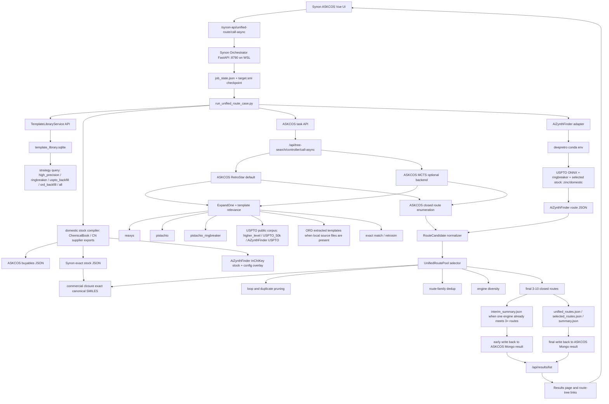

# Current Retrosynthesis Architecture

This document records the architecture currently wired into Synon. ASKCOS stays
the primary UI, task-history, and route-viewing product. Synon adds a WSL host
orchestrator that runs ASKCOS and AiZynthFinder in parallel, merges their route
outputs, and writes the selected route pool back into ASKCOS Mongo history.

## Current Runtime Chain

## Shared Data Rule

The long-term data model is one shared reaction/template/stock layer. Engines
may need compiled artifacts, but those artifacts should be generated from and
traceable to the shared source:

| Data product | Current state | Target state |
|---|---|---|
| Reaction records | ASKCOS Mongo data is active; AiZynthFinder uses model-packaged data | Shared imports from USPTO, ORD, Organic Syntheses, licensed Pistachio/Reaxys where available, and patent/literature sources |
| Template library | ASKCOS template sets active; AiZynthFinder policy files separate; Synon now compiles a shared SQLite template database plus manifest and exposes it through TemplateLibraryService | One canonical template source, queried by strategy and compiled into ASKCOS and AiZynthFinder-specific trained/serving artifacts |
| Buyables stock | ASKCOS buyables, AiZynthFinder ZINC stock, Synon exact stock matching, and domestic stock compiler are active | Keep ChemicalBook/domestic supplier exports refreshed, audited, and promoted into all three runtime stock artifacts |

## Availability

| Component | Current status |
|---|---|
| ASKCOS UI/API/history | Active primary product shell |
| Synon Orchestrator | Active UI/API path at `/synon-api/unified-route/call-async` |
| ASKCOS RetroStar | Default ASKCOS route-tree backend |
| ASKCOS MCTS | Available optional backend |
| ASKCOS exact/retrosim/template relevance pools | Active inside ASKCOS search |
| Pistachio ringbreaker | Imported as `pistachio:ringbreaker` and available in ASKCOS pool |
| AiZynthFinder USPTO | Active real runner through local `deepretro` conda environment |
| UnifiedRoutePool | Active selector for 3-10 closed routes with route-family dedup and engine diversity |
| Mongo write-back | Active; unified selected routes appear in ASKCOS results history |
| AiZynthFinder Pistachio_100+ | Not enabled; licensed assets are missing |
| LLM review | Not connected to final selector; should only review/rank/explain after deterministic gates |
| External stock-file exact matching | Active through `--external-stock`, `external_stock_paths`, or orchestrator default `SYNON_EXTERNAL_STOCK_PATHS`; supports CSV/TSV/SMI/JSONL/JSON with exact SMILES |
| ChemicalBook/domestic stock | Active as an import-and-compile pipeline for supplier exports; automatic web crawling is intentionally not used as a source of truth |
| AiZynthFinder domestic stock | Active as compiled InChIKey stock plus `domestic` stock config overlay; route jobs can pass `--aizynth-stock domestic` when the compiled stock is present in the selected config |
| Canonical template database/service | Active through `scripts/data_import/compile_template_library.py`; supports `--source-dir` auto-discovery plus `--include-standard-local-sources`, outputs `template_library.sqlite`, stores `direction` and `domain`, exports ASKCOS runtime template files from the database, and exposes `/synon-api/template-library/health` plus `/synon-api/template-library/query` when `SYNON_TEMPLATE_LIBRARY_DB` is configured |
| ASKCOS template runtime overlay | Active when `SYNON_TEMPLATE_RUNTIME_ASSETS_DIR` points to compiled runtime assets; `import_askcos_core_data.sh` seeds ASKCOS from `retro.templates.synon_unified.json.gz` and `forward.templates.json.gz` instead of the default hard-coded template bundle |

## Verified Real Task

| Date | Target | Submission path | Result |
|---|---|---|---|
| 2026-07-01 | `OC(C(F)=CC=C1)=C1C2=CC3=C(NCC34CCNCC4)N=N2` | `http://127.0.0.1:8769/synon-api/unified-route/call-async` | ASKCOS RetroStar produced 10 closed routes, AiZynthFinder produced 6 closed routes, unified pool selected 6 closed route families, and the result appeared first in `/results` |

## Verified Data Compiler Smoke

| Date | Compiler | Input | Result |
|---|---|---|---|
| 2026-07-04 | ORD official data import | Official `open-reaction-database/ord-data` Hugging Face/Git LFS dataset mirror downloaded to `data/external/ord-data`; first 1,000 real ORD reactions atom-mapped through local `atom_map_rxnmapper` and extracted through `scripts/data_import/extract_ord_templates.py` | Wrote `data/compiled/ord_templates/retro.templates.ord_extracted.json.gz` with 316 deduplicated ORD templates from 997 accepted template occurrences; 3 reactions rejected by strict extraction audit |
| 2026-07-04 | Canonical template database/service | Real ASKCOS template directory plus standard local USPTO sources and extracted ORD templates: `ord_extracted`, `uspto_higher_level`, `USPTO_50k`, AiZynthFinder `uspto_templates.csv.gz`, and AiZynthFinder `uspto_ringbreaker_templates.csv.gz` | Auto-discovered 11 local template sources, indexed 531,571 raw records, wrote 531,546 valid SMARTS records into `template_library.sqlite`, rejected 25 invalid records, and verified `high_precision`, `ringbreaker`, `public_reaction_corpus`, `uspto_backfill`, `ord_backfill`, `metabolism`, `biocatalysis`, and `forward_validation` strategy queries |
| 2026-07-04 | Canonical template runtime export | Same real local template sources | Exported ASKCOS runtime gzip JSON arrays from `template_library.sqlite`, including `retro.templates.synon_unified.json.gz` with 514,457 retro templates plus per-source retro files and `forward.templates.json.gz`; `ord_backfill` now resolves to `ord_extracted` |
| 2026-07-01 | Domestic stock compiler | ChemicalBook-format CSV row with exact SMILES, CAS, catalog id, product URL, availability | Wrote ASKCOS buyables JSON, Synon stock JSON, AiZynthFinder InChIKey stock, AiZynthFinder stock config overlay, and rejected-row audit files |

## Remaining Gaps

| Gap | Current state | Required next implementation |
|---|---|---|
| Early partial write-back | Implemented: `interim_summary.json` is written when a completed engine reaches 3+ selected routes, and Mongo write-back runs early when the ASKCOS task id is known | UI can next add a distinct `partial_ready` visual state instead of relying only on final completion |
| Route-tree detail labeling | Results card shows unified source counts | Route graph should label each route/source as ASKCOS or AiZynthFinder inside the detail view |
| Domestic buyables | Structured stock compiler is implemented and outputs ASKCOS/Synon/AiZynthFinder artifacts | Add scheduled import jobs from approved supplier exports and data freshness checks |
| Shared template provenance | Canonical SQLite database and query service exist with `direction` and `domain`; ASKCOS serving assets are now exported from the database; USPTO ASKCOS, AiZynthFinder template CSV files, and extracted ORD templates are now in the shared database, while AiZynthFinder model-serving assets remain separate | Continue full ORD extraction beyond the initial 1,000-reaction import and add AiZynthFinder artifact build manifests for retraining/serving |
| LLM review | Not part of final live selector | Add post-gate review for ranking tie-breaks, conflict analysis, and conditions narrative only |

## Hard Rules

| Rule | Status |
|---|---|
| ASKCOS remains primary UI and task/history system | Enforced |
| New route tasks use the unified ASKCOS + AiZynthFinder orchestrator | Enforced for Synon UI route-tree submissions |
| Final output is 3-10 closed route families | Enforced by `UnifiedRoutePool` |
| No silent model fallback | Enforced for AiZynthFinder model configs |
| LLM does not invent routes | Enforced by omission; LLM is not yet connected to route generation |
| Every live task appears in history | Enforced through ASKCOS task creation and Mongo write-back |
| Any early sufficient route set appears before the slower engine finishes | Enforced through `interim_summary.json` and early Mongo write-back |
| ChemicalBook/domestic supplier evidence must be exact structure evidence | Enforced by domestic stock compiler and stock registry; weak rows are rejected |

## Data Compiler Commands

| Task | Command |
|---|---|
| Compile ChemicalBook/domestic supplier exports | `PYTHONPATH=. python3 scripts/data_import/compile_domestic_stock.py --source supplier_export.csv --output-dir data/compiled/domestic_stock` |
| Use compiled stock for unified closure | Pass `data/compiled/domestic_stock/synon_stock.json` through `external_stock_paths` or `--external-stock` |
| Use compiled stock by default in UI route jobs | Start the Synon orchestrator with `SYNON_EXTERNAL_STOCK_PATHS=data/compiled/domestic_stock/synon_stock.json` |
| Use compiled stock in AiZynthFinder search | Merge `data/compiled/domestic_stock/aizynthfinder_stock_config.yml` into the selected AiZynthFinder config and run with `--aizynth-stock domestic` |
| Build canonical template database from all local ASKCOS and standard USPTO/ORD sources | `PYTHONPATH=. python3 scripts/data_import/compile_template_library.py --source-dir apps/askcos-v2/askcos2_core/data/db/templates --include-standard-local-sources --project-root . --output-dir data/compiled/template_library --version 2026.07` |
| Build canonical template database and ASKCOS runtime assets | `PYTHONPATH=. python3 scripts/data_import/compile_template_library.py --source-dir apps/askcos-v2/askcos2_core/data/db/templates --include-standard-local-sources --project-root . --output-dir data/compiled/template_library --version 2026.07 --export-runtime-assets` |
| Seed ASKCOS from compiled template runtime assets | `SYNON_TEMPLATE_RUNTIME_ASSETS_DIR=data/compiled/template_library/runtime_assets/askcos_templates scripts/data_import/import_askcos_core_data.sh` |
| Enable template service API | Set `SYNON_TEMPLATE_LIBRARY_DB=data/compiled/template_library/template_library.sqlite` before starting the Synon orchestrator |
| Query templates by strategy | `POST /synon-api/template-library/query` with `{"strategy":"high_precision","min_count":10,"limit":100}` |
| Query public USPTO/ORD backfill domains | `POST /synon-api/template-library/query` with `{"strategy":"uspto_backfill","limit":100}` or `{"strategy":"ord_backfill","limit":100}` |
| Query specialized domains | `POST /synon-api/template-library/query` with `{"strategy":"biocatalysis","limit":50}` or `{"domain":"metabolism","limit":50}` |
