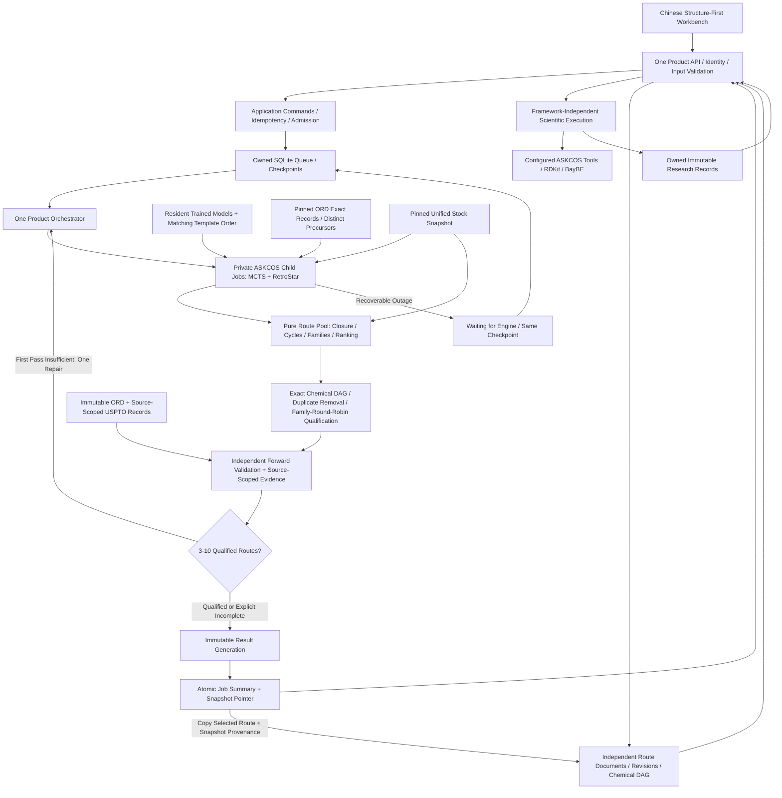

# X-Synth Architecture

## Product Boundary

X-Synth owns the existing Chinese Vue workbench, product API, job state,
history, unified stock evidence, route selection, and delivery. ASKCOS V2 is
the only integrated retrosynthesis engine. New search engines must implement the same
adapter contract; they are not prerequisites for ASKCOS. LLM integration is
deferred. Neither model login tokens nor browser sessions are extracted.

## Source and Data Ownership

| Boundary                        | Authoritative Location                     | Responsibility                                                                                    |
| ------------------------------- | ------------------------------------------ | ------------------------------------------------------------------------------------------------- |
| Product version                 | VERSION                                    | One increment per merged main PR; patch radix 100, minor radix 10                                 |
| Release receipts                | .github/version-state.json                 | Baseline and counted PR merge identities; serialized atomic publication, never a second version source |
| Frontend                        | apps/web                                   | Existing Vue workbench, Chinese UI, editor, history, route viewer                                 |
| Product API                     | apps/api                                   | Input validation, identity boundary, capability delegation, response models                       |
| Product jobs                    | packages/orchestrator                      | One lifecycle, resource admission, checkpoints, route workflow                                    |
| Result publication              | packages/orchestrator/route_artifacts.py    | Immutable generations; committed job pointer is the only delivery authority                        |
| Route documents                 | packages/workspace                         | Independent documents, canonical chemical DAGs, immutable source provenance, optimistic revisions |
| Research records                | packages/workspace/analysis_repository.py   | Immutable input/result snapshots, owner isolation, interrupted-process recovery                   |
| Scientific execution            | packages/workspace/analysis_execution.py    | Shared application service; API routing and job orchestration do not call each other's controllers  |
| Concrete chemical input         | packages/workspace/reaction_input.py, reaction_compounds.py, chemical_reactions.py | One RDKit authority for draft roles, RXN interchange and exact explicit compound grouping |
| Reaction optimization           | packages/adapters/optimization             | Real BayBE computation, bounded subprocess admission, measured-data and result binding              |
| Molecular and process metrics   | packages/chemistry                         | Maintained RDKit descriptors, user-input mass accounting, atom provenance                           |
| ASKCOS integration              | packages/adapters/askcos                   | Typed transport, native search invocation, recoverable errors                                     |
| Native algorithms and functions | apps/askcos-v2                             | Full ASKCOS source, isolated native runtime                                                       |
| Commercial evidence             | packages/adapters/stock                    | Exact catalog validation, immutable indexed snapshots, batch lookup                               |
| Shared knowledge                | packages/knowledge_base                    | Reaction/template provenance and query index                                                      |
| Normalized routes               | packages/route_schema, packages/route_pool | Engine-independent routes, family selection, existing viewer projection                           |
| Deterministic checks            | packages/validation, packages/scoring      | Structural validation, closure, cycles, scoring                                                   |
| Repeatable operations           | scripts/operations, scripts/data_import    | Startup, asset installation, imports, source publication                                          |
| Verification                    | tests, .github/workflows                   | Unit, integration, contracts, security, build and deployment gates                                |

Source checkouts use stable unversioned paths. Models, supplier data, database
volumes, private jobs, logs, caches, generated reports and screenshots are not
source. The runtime state root is configured by X_SYNTH_STATE_DIR; assets are
configured through explicit operator paths. A source release does not contain
private data or model weights.

ASKCOS component versions, model checksums, template ordering, database schema
versions and inventory snapshot versions are independent of the product PR counter.
The package metadata and frontend lockfile verify VERSION rather than define
another product version.
The merged-PR workflow reconciles every reachable uncounted merge since its frozen
baseline. A temporary Git index creates one fast-forward-only metadata commit;
repeated events are no-ops, and concurrent changes require a fresh reconciliation.
The carry rule is project-specific, not a substitute for API/schema compatibility
governance. See [version operations](operations.md#版本管理).

## Single Authorities

- Browser requests terminate at the product API, never a second direct gateway.
- Reaction reference search, NN conditions and FF share one reaction canvas,
  one draft API and separate draft/file lifecycle controllers. Ketcher renders
  validated RXN; it does not replace RDKit role parsing or source identity checks.
  File/SMILES-declared salts retain exact component counts through the older editor;
  undeclared ions are not inferred to be salts. Legacy single-molecule inputs and
  explicit model submission remain unchanged. See [Workspace Workflows](workspace-workflows.md).
- Product job IDs and ownership are authoritative in the transactional job store.
  Native engine execution is a child operation, not another product task owner.
- Accepted idempotency receipts are resolved before readiness checks. Replaying a
  receipt cannot create another job; reusing its key for a different request is a
  conflict. New requests still require a ready engine and valid admission.
- Review builds a pure route pool, then seals a content-addressed result generation.
  Only one database transition commits its summary and snapshot pointer. Partial
  files, cancelled work and uncommitted generations cannot appear as delivered routes.
  Readers verify manifest checksums, target identity and committed summary agreement;
  corrupt published data is an explicit error, never a false empty result.
- Task grouping, display titles and recoverable archives use schema-2 metadata in
  that same store. Metadata revisions are independent of worker revisions; they
  never rewrite scientific requests, execution states or checkpoints. Owner-filtered
  pages and counts use one SQLite read transaction without decoding large checkpoints.
- Search and final closure must use the same immutable stock snapshot. Snapshot
  identity is retained in the checkpoint and delivered result.
- A CID, CAS, supplier name or Mongo internal ID alone is not commercial evidence.
  Unknown prices remain unknown; no synthetic price is allowed.
- Literature search combines independently validated native USPTO records with a
  separate immutable ORD reaction index. It does not change retrosynthesis model
  output ordering, commercial terminal decisions or neural condition predictions.
  Exact product identity and full reactant matching remain distinct; a product-only
  match cannot establish the conditions or yield of the predicted step.
- Catalog price projection is bound to the exact compound, supplier catalog key
  and immutable stock snapshot. Legacy `ppg` uses the documented `$/g` convention;
  ISO currency, quotation date, package and purity remain unknown when absent.
  Live quotes and full-route cost are not inferred from those catalog values.
- Native trained models retain their exact template index and fingerprint
  parameters. A shared template query database cannot replace a trained output
  ordering. Imported ORD/USPTO templates are knowledge assets until a compatible
  native proposal mechanism is configured.
- The existing one-step expansion also retrieves exact-product precursors from
  the configured immutable ORD record index. Repeated condition variants do not
  count as different precursor sets. Recorded agents remain separate from
  structural precursors; disconnected compound groups that native search cannot
  preserve are explicitly unsupported, not split into purchasable fragments.
  Retrieval uses a bounded uniform search prior, never a neural confidence or
  experimental success probability. Known measured zero-yield records are not
  promoted as successful recorded proposals. No SMARTS is fabricated.
  Exact record identity is checked again against the pinned source during review,
  separately from template reconstruction; both still require an independent
  Graph2SMILES candidate, the unchanged FF threshold, exact stock closure and DAG
  checks. Model top-1 agreement is the default. A lower-ranked target candidate
  is supported only by an exact ORD reaction with positive target yield, recorded
  conditions, ready pinned sources and untruncated retrieval. Product-only matches,
  missing/zero yields or a target absent from model candidates cannot pass.
  Review version 2 distinguishes model top-1 from recorded-reaction support;
  original experimental conditions do not certify new conditions or a new experiment.
  Unmapped record-only first moves share a conservative target family, preventing
  leaving-group variants from inflating the requested diversity count.
- The configured ORD bytes and proposal code belong to the native checkpoint
  identity. Readiness verifies that expansion and review use the same available
  ORD snapshot; an absent optional source stays absent in both processes. Changing
  the configured source cannot reuse an old search graph. Native USPTO remains
  a source-scoped reference provider, not an implicitly installed proposal model.
- Quality evaluation and a bounded second search are coordinated once by the
  product pipeline. Layered repair loops must not multiply silently.
- Qualification visits the finite normalized candidate pool rather than imposing
  an output-count multiplier. Families are interleaved, and a failed representative
  cannot hide later alternatives. Identical chemical routes across engines share
  inference; covered families do not consume more model calls. Unchecked candidates
  are pending, not scientific failures. Final selection still uses first-move
  families; this is not a claim of globally independent whole-route strategies.
- Native route enumeration balances target OR branches. Inside each target
  reaction it interleaves the original ordered traversal with an all-depth OR
  traversal, deduplicating complete source-path structures before they consume
  the one candidate budget. Both traversals share the same expansion and projection
  implementation; neither is another route engine or a compatibility fallback.
  Uniform deep rotation alone can exclude useful ordered precursor combinations.
  Each chemical retains the existing `max_trees` cap, `max_depth` cutoff and
  ancestor exclusion; reactions require all precursors in the original nested
  AND Cartesian order. No subgraph or failed-result cache is added. Exact terminal/
  stock decisions, unknown prices, source graph and path/UDS metadata are unchanged.
  This is finite-budget coverage and ordering, not a guarantee that every old path
  remains, more routes qualify or chemistry succeeds. FF, independent forward,
  procurement and source-scoped reference gates remain unchanged.
- Native cluster labels prioritize candidate representatives only. They cannot
  impose a family quota before independent qualification: all enumerated paths
  within the candidate budget remain eligible. Native statistics distinguish
  enumeration count, retained count and candidate limit. Final chemical duplicate
  removal and qualified first-move-family selection remain product responsibilities.
  On an optional pathway-ranker failure, both strategies explicitly retain a
  non-neural overall-plausibility ranking with higher scores first; diagnostic
  metadata retains the failure class only, never exception text or input data.
  This changes ordering, not structural, forward or catalog acceptance.
- Final qualification verifies canonical structure, reaction-field agreement,
  source-pathway agreement, a connected target DAG and exact external leaves.
  Isotopes, stereochemistry, charges, salts and precursor multiplicity remain
  identity-bearing. Source reaction counts do not establish purchasability. Total
  route length is a ranking cost, not a default chemistry-failure cutoff.
- Unknown-price catalog evidence remains available to native terminal and
  heuristic decisions. Zero estimated remaining synthesis cost is not a zero
  procurement price. Catalog evidence and its snapshot survive cached lookups.
- Literature citations retain exact queries, source snapshots/readiness and
  truncation. Returned no-match is not proof of absent literature. Reactant/product
  identity excludes agents, conditions and outcomes; recorded conditions/yields
  are counted only for that identity and are not copied onto a predicted step.
- CPU-heavy route review runs in one owned, cancellable child process. Cancellation
  interrupts that child without a chemistry time limit or signalling unrelated
  processes; API handling and task observation remain available.
- Native status polling contains progress only. Every full explored graph is
  preserved privately, while a separate bounded artifact delivers every enumerated
  route. Large graphs must not be serialized into every status response.
- Asset identity includes the actual catalog bytes, model/checkpoint/template
  checksums and native algorithm source. Recovery cannot mix altered assets.
- Loopback workspace mode is explicitly single-user and rejects cross-site access.
  Shared deployments require configured identity verification and private owners.
- Native ASKCOS functions without installed models or required authorization must
  remain unavailable, not be presented as working features.
- Forward HTTP and native-handler inputs share the strict molecular parser before
  graph featurization. Invalid or unbonded inputs cannot reach upstream dummy
  ethane substitutions; valid explicit hydrogen and repeated reactants retain
  their actual features. Handler telemetry excludes submitted structures,
  predictions and private asset paths. Training utilities remain upstream source,
  not a second product-input authority.
- New route admission requires the independent forward-qualification service as
  well as proposal, search and exact-stock dependencies. An unavailable qualifier
  cannot allow an expensive search to start and fail only during delivery review.
  Optional condition and impurity tools do not become route-admission dependencies.

### Native Lifecycle

`native_endpoints` is the address authority for supervised launch, gateway
configuration, private invocation and readiness. Managed services use distinct
IPv4 loopback ports. The private search protocol is versioned independently of
the product; readiness must prove both its expected response and rejection of an
incorrect internal credential. Public documentation/health alone cannot certify
this channel. The launcher generates an ephemeral internal key, never a user
token, and does not publish or persist it. Unmanaged gateway search wrappers are
disabled in the product profile; upstream source remains preserved.

An inherited ownership lease prevents duplicate supervisors before allocation.
Runtime manifests bind a generation, boot identity, PID, start time, session and
UID. Cleanup uses verified pidfds and retained descendants, not an arbitrary
process-group number. Log writers rotate bounded files and redact the internal
key. Unknown or legacy ownership metadata is refused rather than used to kill
processes. An operator archives legacy metadata only after stopping the canonical
unit and proving its recorded processes are gone.

Child cancellation is persistent: a recorded cancellation cannot become new work
after restart. Controlled model calls propagate cancellation/deadlines, forbid
redirects and compressed native payloads, and bound request/response bytes. Shared
inference has admitted queues and chunked fingerprint/ranking batches. Resource
limits are availability controls, not zero scores or chemical-success shortcuts.

Native search submission, progress polling and result retrieval share one bounded
reconnection budget. Recoverable interruptions resume the same child ID and exact
input/checkpoint; completed sibling strategies are never re-executed. Permanent
protocol/authentication errors are not retried. Exhaustion remains recoverable
waiting, not a route success, discarded graph, or new task. Product-worker shutdown
preserves native children; user cancellation prevents resubmission.

Failure attribution traverses a bounded exception cause chain and retains only
allowlisted service/operation identifiers and a request digest. Native child
records retain that context separately from the strict three-field HTTP failure
envelope. Request bodies, molecular structures, URLs, credentials and exception
messages are not copied into diagnostic context. Checkpoint progress is sampled
and must not be misrepresented as the exact failing expansion.

### Immutable Data

Stock, template and reaction readers share an immutable SQLite guard with pinned
device/inode/size/timestamp identity, required schemas/indexes, rejected sidecars
and query deadlines. Cached evidence is copied defensively and revalidated after
lookup. The orchestrator checks stock identity before search, review and publication;
the review child separately matches the search-bound digest.

Template compilation uses a private staging database, validates it, and publishes
without replacing any existing snapshot or manifest. Statistics are compiled once
for bounded monitoring, rather than scanning large template tables on each poll.
Imports use one supplier-evidence authority. Missing prices, CAS and current
stock remain unknown; a catalog record is not a live procurement confirmation.

Catalog composition streams existing immutable snapshots with bounded keyset
reads and new supplier records through that same authority. Input files are never
overwritten. Conflicting records require explicit resolution instead of silently
keeping the first price; supplied InChIKeys must agree with the exact structure.
Verified small catalogs complement, rather than replace, the large stock corpus.

Route documents retain repeated reactant input records on unique graph edges.
These integer occurrences are not measured equivalents or stoichiometry. Default
one preserves legacy serialization and signatures; changes invalidate source
evidence and survive JSON, editor, RXN and model-input round trips.

## Workspace Interaction and Documents

The layout shell owns navigation, theme and live readiness only. Task composition,
task history, result detail, route documents and graph editing are separate pages.
The sidebar exposes design, tasks/routes, stock lookup, reactions/conditions,
structure tools, batch process accounting and measured-data experimental optimization.
Environment deployment remains in the footer. Each workspace
has its own capability-filtered navigation; single-tool workspaces have no redundant
tab strip. Ready forward/context tools are direct reaction tabs; optional solubility/QM
tools remain secondary. A research workspace with no ready tools is hidden. Active
workspace links preserve chemical prefill. There is no additional portal, result
portal or bypass execution path. Research calculations use one owned analysis repository,
separate from route jobs and editable route documents. Editing and step-wise design remain actions
inside the route workflow; task detail and editor retain their immersive canvas.
The structure-first composer has three explicit modes: route search, one-step
analysis, and X-Synth JSON import. `/retro` redirects to `/?mode=manual`; the
replaced standalone one-step page is removed. There is one route handler per page.
The shared molecule inputs use the same authenticated RDKit chemical-file boundary
for MOL/SDF/SMILES, explicit multi-record selection and round-trip identity-checked
export. RXN input is a single reaction, with agents separated from model inputs.
Route JSON remains a distinct graph-document interchange format. Chemical files
neither create jobs nor certify routes. Conventional synthetic step order is derived
from precursor dependencies while source reaction IDs and validation indices remain
unchanged. The complete domain workflow and unsupported format boundaries are defined
in Workspace Workflows, rather than separate ad hoc input rules per page.
Legacy `/network` URLs redirect to their new
destination; retired Launchpad, vis-network graph views and their global result
store are removed. Business workspace labels do not use third-party branding;
actual backend/model provenance is retained in technical details and result data.

`/environments` is the single deployment inventory with engine, configuration
and monitoring tabs. ASKCOS V2 is the only integrated engine, not the frontend
brand. The authenticated, read-only `/api/v1/environments` response projects
existing cached health and resource metrics through `packages/platform/environments.py`;
it does not create another probing service, process supervisor, engine registry,
or job workflow. Only known model names and safe configuration fields are exposed;
unknown model configuration values are counted, never returned. Process presence,
model readiness and product worker readiness remain distinct measurements.

The monitor makes two requests: this environment projection and template-library
health. Stock identity is taken from the same authoritative health snapshot rather
than issuing a second stock request. Legacy `/status` links redirect to the
monitoring tab; the replaced status component is removed. Lifecycle operations
remain in the canonical operator CLI/systemd entrypoint. There is no browser
shell, installation, restart, or pretend engine-switch API.

The inventory now distinguishes configured/probed native modules, preserved
disabled source, unwired adapters and unintegrated software. Product-proxied
runtime capabilities report configured trained models rather than the upstream
deployment manifest. Unmanaged native model async calls are rejected; managed
route jobs retain their existing product entrypoint and conflict contract.

Read-only route and document previews share node inspection. Molecule lookup
compares current catalog identity with the source task snapshot; reaction tools
derive structures from the actual graph and prefill without auto-prediction.
Template detail is an indexed, source-scoped lookup, preserving native identity
and filtering unsafe evidence links. Strategy definitions include actual
matching counts so unavailable ORD/USPTO/forward assets do not appear loaded.
Preserved native history uses the existing route decoder but does not recertify
closure. Lifecycle status remains usable independently of route-artifact errors.
Lightweight status polling and full artifact refresh are separate. A stable
published snapshot does not trigger repeated route downloads. Read failures retain
the last visible routes with an error, but stale copy/edit actions remain disabled
until a successful refresh confirms their identity. Leaving a calculation page
stops observation, not the owned remote calculation.
Full interaction paths and reference access boundaries are recorded in
[Workspace Workflows](workspace-workflows.md).

Preview and edit share `components/routes/RouteGraph.vue`. Scientific structures
are generated by the actual RDKit capability. Vue Flow owns pan, zoom, selection,
drag and connections; Dagre supplies layout and graph cycle checks. UI-only graph
state is not serialized into scientific records. Graphs contain alternating
molecule/reaction nodes and directed precursor-to-reaction-to-product edges.
Preview, reader and editor allow fit-view zoom down to 0.01 so wide routes can
fit narrow canvases instead of clipping terminal structures at a fixed 0.12
floor. This is display scaling, not a change to chemical coordinates or search
quality. Overview cards retain their existing whole-graph lazy mounting.
The server repeats graph and RDKit validation rather than trusting UI checks.
Topology preparation is distinct from display layout. Read-only inspection reuses
prepared topology and incoming-edge indexes instead of rerunning Dagre on every
selection. One-step candidate identities are stable within their session; they
never become server-assigned task provenance.

The `/api/v1/route-documents` API stores private documents in `workspace.sqlite`
under the configured state root. Schema version 1 is independent of product
version in VERSION. Unknown schema versions are refused before mutation. Save requires
the current revision; conflicts return 409 without losing the unsaved client
graph. Lists return bounded summaries, not full graphs. Deleting a document
actually deletes its record; moving a task out of history retains the existing
archive contract and is labeled accordingly.

`from-task` copies only a real selected route owned by the caller. Provenance and
scores are set by the server, never an imported JSON or client-supplied flag.
Current clients bind the selected index to its route ID; a changed selection is
rejected rather than copied as a different route. Published source provenance also
retains the immutable result snapshot. Legacy index-only callers remain compatible.
Layout and annotations preserve the original chemical signature. Any chemistry
change invalidates original prediction scores and closure, even if restored
later. Edited documents are drafts, not independently validated model outputs.
JSON import creates a draft. PNG export captures all nodes and branches, not
just the current zoomed viewport. Interactive continuation uses the same real
ASKCOS one-step adapter as manual mode; it cannot turn manual edits into
a completed computation task.

### Structure-First Interaction

The interaction organization was informed by the observable Chemiscal home,
task list and route list, not its private source code or search implementation.
X-Synth retains its own identity, Ketcher and the actual ASKCOS capability
boundary. Unsupported groups, similar-molecule routes, price/risk/yield claims,
industrial scale-up prediction and proprietary CDX/Marvin integrations are not added.
Condition/forward predictions, molecular metrics, batch PMI and BayBE experiment
recommendations are independent scientific capabilities, not substitutes for those claims.

- The composer owns mode/navigation; `useRouteWorkbench` owns real submission;
  `workbench-model` owns supported query presets; the authoritative
  `buildUnifiedRouteRequestBody` continues to own route payload bounds.
- A shared session-only store preserves structure/settings across navigation.
  Mode switches and readiness polling do not recreate the drawing board.
  Submission awaits the pending typed-structure import before reading Ketcher.
  The UI displays minutes while the existing API receives seconds.
- Manual candidate results retain their own target/model snapshot. Display is
  paged without losing candidates; editing creates an unclosed draft, not a
  completed task. Both import entries use `route-document-file` and server DAG
  validation; client provenance cannot certify a route.
- History offers structural cards and a compact list, bounded pagination,
  real state filters, actual parameter details, route preview and rerun presets.
  Rerun only restores supported settings; submission remains an explicit action.
- Route detail supports graph, steps and comparison overview, using only actual
  structures/metadata. Filtering and ordering retain original source indices for
  `from-task` copies. No fabricated difficulty, cost, yield or literature is shown.
- Graph/list images begin their timeout only when actual browser loading starts.
  Offscreen lazy images cannot be mislabeled failed before entering the viewport.

## Performance Contract

PerformanceBudget is the product resource authority. Native runtime setup maps
its values into native worker/thread settings. Resource ceilings do not relax
chemical validation or mark unfinished searches complete.

| Resource                    | Default        | Reason                                                                 |
| --------------------------- | -------------- | ---------------------------------------------------------------------- |
| Active product tasks        | 1              | Avoid competing large route graphs on a local workstation              |
| Queued product tasks        | 64             | Bounded admission with explicit queue-full response                    |
| Native search parallelism   | 2              | MCTS and RetroStar proceed independently                               |
| Model execution parallelism | 1              | Shared model weights are loaded once, not per task                     |
| Route review process        | 1              | CPU-heavy chemistry checks cannot block the API interpreter            |
| Model CPU threads           | 4              | Prevent native pools consuming all host CPUs                           |
| Stock SQL chunk             | 500 structures | Indexed batched lookup, bounded parameters                             |
| Native child queue          | 8 per strategy | Bounded internal admission                                             |
| Molecular input             | 1024 atoms     | Reject unsupported inputs before expensive normalization               |
| Readiness cache             | 10 seconds     | Lifespan-owned refresh at half TTL; only valid identity-matched entries bypass refresh locks |
| Dependency probe timeout    | 2 seconds      | Parallel, cancellable HTTP probes with one total connection/header/body deadline |
| History query deadline      | 1 second       | Abort oversized indexed history reads with 503; never return a false empty page |
| Request budget              | 10 MiB         | Bounded untrusted input                                                |
| Native response budget      | 32 MiB         | Explicit oversized-response handling, no silent truncation             |

The existing service-status page reads product health and runtime metrics.
Application startup performs the existing authoritative readiness checks before
starting its refresh worker. That one lifecycle-owned worker refreshes at half
the unchanged cache TTL; it does not introduce another readiness authority or
reload native model weights. Valid cached reads recheck runtime/configuration
identity and expiry before returning, without queuing behind a physical refresh.
Expired, invalidated or generation-mismatched entries require actual probes.
Failed physical checks replace the cached readiness with their actual not-ready
outcome; refresh exceptions invalidate it. Neither authorizes a stale ready response.

Health HTTP probes own their sockets and use the standard-library HTTP parser
over deadline-aware I/O. One total deadline covers connection, response headers
and bounded body reads, including both authentication probes for native search.
Shutdown cancellation interrupts the owned probe work and is coordinated with
cache publication. The non-daemon refresh worker is joined during application
shutdown; unexpected worker failures remain explicit readiness failures.
Authentication, configured-model, stock/evidence identity and forward-readiness
checks are unchanged. Probe and cache optimizations cannot qualify a chemical route.

Runtime memory is sampled only for supervised PIDs with matching start-time
identity, preventing PID reuse from attributing another project's process.
Owned descendant processes are included, with parent/start-time checks and a
bounded process/thread traversal. RSS is summed per process and can count shared
pages more than once; it is not a system-wide physical-memory or PSS measurement.
12 GiB native RSS is a warning threshold, not a chemical-completion shortcut.

## Repository Governance

The stable checkout is /srv/wsl/projects/x-synth. Allowed root files are VERSION,
README.md, LICENSE, NOTICE, pyproject.toml, .env.example and .gitignore. Allowed
directories are apps, packages, configs, requirements, scripts, tests, docs and
.github. Source publication uses the same allowlist and excludes runtime data.

The product API contract is /api/v1; the existing /api native capability and
result projections serve the ASKCOS-derived UI through that same host. There is
no separate legacy orchestrator or /synon-api job owner. Job schema 2 and native
UDS schema 2 are independent of the product VERSION. First-party dependency authorities
are one lock per documented process boundary: product, native ASKCOS, TF-Keras
condition inference, RXNMapper impurity analysis, BayBE optimization and offline
ORD import, plus apps/web/package-lock.json; upstream
requirements and deployment samples do not define the product installation.

Task worktrees use refactor/ or fix/ branches and contain no private assets.
Deploy a tested revision with matching immutable assets; preserve private state
and the previous revision for rollback. Generated dist, coverage, logs, screenshots
and downloads are not source. Public exports cannot include model weights or
supplier/database dumps. Third-party notices are retained beside their sources.

Acceptance targets are measured against the actual configured snapshot and
models, not mocked latency. Targets are not claims of an already-passed run.

| Path                        | Acceptance Target                                                         | Evidence                                                            |
| --------------------------- | ------------------------------------------------------------------------- | ------------------------------------------------------------------- |
| Warm exact stock lookup     | p95 <= 25 ms                                                              | At least 100 real accepted structures plus misses                   |
| Stock batch lookup          | p95 <= 500 ms for 500 structures                                          | Real SQLite snapshot; no per-structure connection loop              |
| Warm product status/history | p95 <= 250 ms                                                             | Concurrent reads during real search, sampled across multiple cache refresh periods |
| Cold dependency readiness   | <= timeout + 1 second                                                     | Independent probes, including unavailable services                  |
| Native model memory         | One resident copy per configured model                                    | RSS and process inventory                                           |
| Job concurrency             | Never exceed configured admission                                         | Real DB transactions and concurrent claim tests                     |
| Task cancellation/recovery  | No late completion overwrites cancellation; no duplicate search on resume | Lifecycle and real engine integration tests                         |
| Route delivery              | 3-10 qualified distinct families or explicit incomplete/recovery state    | Actual native outputs, exact catalog evidence, deterministic review |
| UI                          | Desktop/mobile layout stable, structure editor and history refresh work   | Real Chrome smoke and screenshots                                   |

`scripts.diagnostics.benchmark_platform` reads an existing real search task;
it never creates or retries a chemical task. Optional finite interval sampling
covers multiple readiness-cache periods. Failed warmups, HTTP/protocol failures,
invalid JSON/job-state responses and failed final observations are retained with
safe endpoint/status/error classifications and make the command fail. Successful
latency percentiles are reported separately from failures; fast failed reads
cannot satisfy the SLO. Measured response documents are discarded immediately,
apart from the bounded pre/post task observations. A control-plane latency result
does not establish model, catalog, experimental or route-count acceptance.

Route duration depends on target complexity, model coverage and purchasable
precursors. It is not a performance promise that an arbitrary target will always
produce three routes in a fixed time.

## Validation and Deployment

Verification scope follows the changed modules and their direct consumers;
full local regression or publication CI requires explicit user authorization.
The exact candidate revision must pass relevant Python regression, frontend tests,
frontend build, dependency audits, API security/input tests, stock/database
integration tests, and real Chrome checks. Native inference must be tested with
the actual installed checkpoints. Final chemistry acceptance runs through the
software, not hand-authored routes or target-specific scripts.

Delivery is complete only after every task PR is merged into main and the exact
main revision is deployed to the existing host entry. PR submission or green CI
alone is not completion. Verify the deployed revision, clean source status,
startup, API/browser connectivity, service readiness and persisted history.

Deploy only the tested main revision. Keep a rollback
revision and immutable data snapshots. Do not stop unrelated WSL workloads,
mutate recovery backups, replace user changes, or publish private assets.
