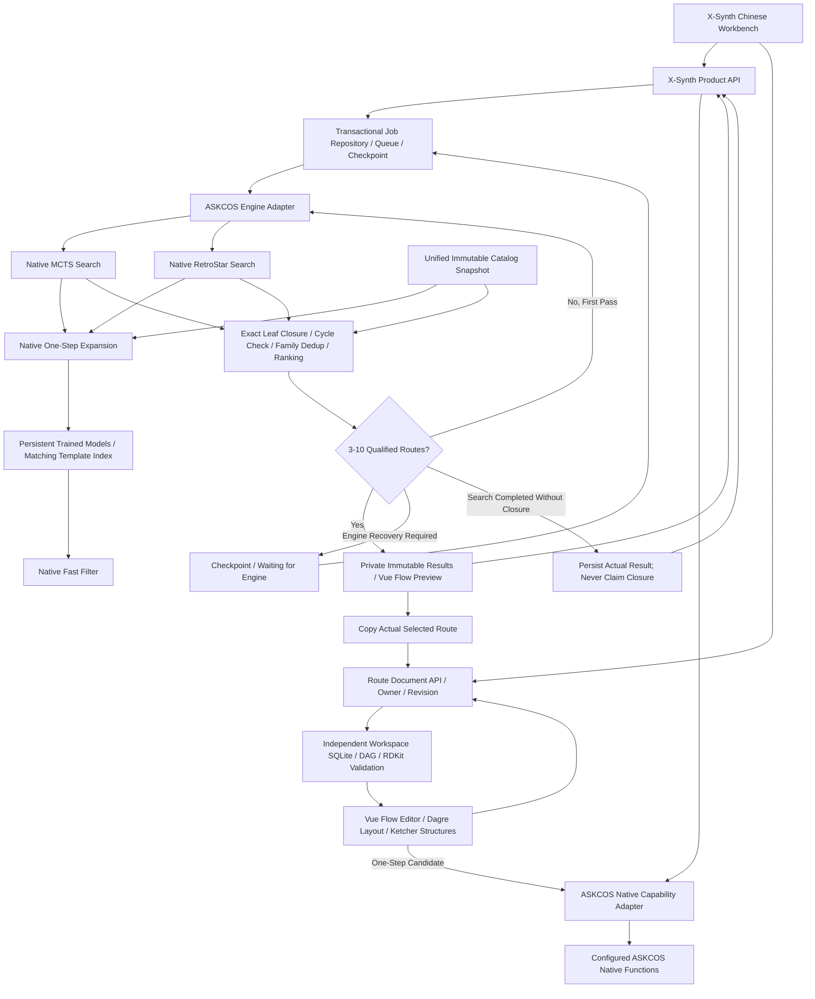

# X-Synth v0.1.0 Architecture

## Product Boundary

X-Synth owns the existing Chinese Vue workbench, product API, job state,
history, unified stock evidence, route selection, and delivery. ASKCOS V2 is
the only integrated chemistry engine. New engines must implement the same
adapter contract; they are not prerequisites for ASKCOS. LLM integration is
deferred. Neither model login tokens nor browser sessions are extracted.

## Source and Data Ownership

| Boundary                        | Authoritative Location                     | Responsibility                                                                                    |
| ------------------------------- | ------------------------------------------ | ------------------------------------------------------------------------------------------------- |
| Product version                 | VERSION                                    | Product SemVer; currently 0.1.0                                                                   |
| Frontend                        | apps/web                                   | Existing Vue workbench, Chinese UI, editor, history, route viewer                                 |
| Product API                     | apps/api                                   | Input validation, identity boundary, capability delegation, response models                       |
| Product jobs                    | packages/orchestrator                      | One lifecycle, resource admission, checkpoints, route workflow                                    |
| Route documents                 | packages/workspace                         | Independent documents, canonical chemical DAGs, immutable source provenance, optimistic revisions |
| ASKCOS integration              | packages/adapters/askcos                   | Typed transport, native search invocation, recoverable errors                                     |
| Native algorithms and functions | apps/askcos-v2                             | Full ASKCOS source, isolated native runtime                                                       |
| Commercial evidence             | packages/adapters/stock                    | Exact catalog validation, immutable indexed snapshots, batch lookup                               |
| Shared knowledge                | packages/knowledge_base                    | Reaction/template provenance and query index                                                      |
| Normalized routes               | packages/route_schema, packages/route_pool | Engine-independent routes, family selection, existing viewer projection                           |
| Deterministic checks            | packages/validation, packages/scoring      | Structural validation, closure, cycles, scoring                                                   |
| Repeatable operations           | scripts/operations, scripts/data_import    | Startup, asset installation, imports, source publication                                          |
| Verification                    | tests, .github/workflows                   | Unit, integration, contracts, security, build and deployment gates                                |

Source checkouts use stable unversioned paths. Models, supplier data, database
volumes, private jobs, logs, caches, generated reports and screenshots are not
source. The runtime state root is configured by X_SYNTH_STATE_DIR; assets are
configured through explicit operator paths. A source release does not contain
private data or model weights.

ASKCOS component versions, model checksums, template ordering, database schema
versions and inventory snapshot versions are independent of product SemVer.
The package metadata and frontend lockfile verify VERSION rather than define
another product version.

## Single Authorities

- Browser requests terminate at the product API, never a second direct gateway.
- Product job IDs and ownership are authoritative in the transactional job store.
  Native engine execution is a child operation, not another product task owner.
- Search and final closure must use the same immutable stock snapshot. Snapshot
  identity is retained in the checkpoint and delivered result.
- A CID, CAS, supplier name or Mongo internal ID alone is not commercial evidence.
  Unknown prices remain unknown; no synthetic price is allowed.
- Native trained models retain their exact template index and fingerprint
  parameters. A shared template query database cannot replace a trained output
  ordering. Imported ORD/USPTO templates are knowledge assets until a compatible
  native proposal mechanism is configured.
- Quality evaluation and a bounded second search are coordinated once by the
  product pipeline. Layered repair loops must not multiply silently.
- Native status polling contains progress only. Every full explored graph is
  preserved privately, while a separate bounded artifact delivers every enumerated
  route. Large graphs must not be serialized into every status response.
- Asset identity includes the actual catalog bytes, model/checkpoint/template
  checksums and native algorithm source. Recovery cannot mix altered assets.
- Loopback workspace mode is explicitly single-user and rejects cross-site access.
  Shared deployments require configured identity verification and private owners.
- Native ASKCOS functions without installed models or required authorization must
  remain unavailable, not be presented as working features.

## Workspace Interaction and Documents

The layout shell owns navigation, theme and live readiness only. Task composition,
task history, result detail, route documents and graph editing are separate pages.
The structure-first composer has three explicit modes: route search, one-step
analysis, and X-Synth JSON import. `/retro` redirects to `/?mode=manual`; the
replaced standalone one-step page is removed. There is one route handler per page.
Legacy `/network` URLs redirect to their new
destination; retired Launchpad, vis-network graph views and their global result
store are removed. Chinese workspace labels do not use third-party branding.

Preview and edit share `components/routes/RouteGraph.vue`. Scientific structures
are generated by the actual RDKit capability. Vue Flow owns pan, zoom, selection,
drag and connections; Dagre supplies layout and graph cycle checks. UI-only graph
state is not serialized into scientific records. Graphs contain alternating
molecule/reaction nodes and directed precursor-to-reaction-to-product edges.
The server repeats graph and RDKit validation rather than trusting UI checks.

The `/api/v1/route-documents` API stores private documents in `workspace.sqlite`
under the configured state root. Schema version 1 is independent of product
version 0.1.0. Unknown schema versions are refused before mutation. Save requires
the current revision; conflicts return 409 without losing the unsaved client
graph. Lists return bounded summaries, not full graphs. Deleting a document
actually deletes its record; moving a task out of history retains the existing
archive contract and is labeled accordingly.

`from-task` copies only a real selected route owned by the caller. Provenance and
scores are set by the server, never an imported JSON or client-supplied flag.
Layout and annotations preserve the original chemical signature. Any chemistry
change invalidates original prediction scores and closure, even if restored
later. Edited documents are drafts, not independently validated model outputs.
JSON import creates a draft. PNG export captures all nodes and branches, not
just the current zoomed viewport. Interactive continuation uses the same real
ASKCOS one-step adapter as manual mode; it cannot turn manual edits into
a completed computation task.

### Structure-First Interaction

The interaction organization was informed by the observable Chemiscal home,
task list and route list, not its private source code or search implementation.
X-Synth retains its own identity, Ketcher and the actual ASKCOS capability
boundary. Unsupported groups, similar-molecule routes, price/risk/yield claims,
process optimization and proprietary CDX/Marvin integrations are not added.

- The composer owns mode/navigation; `useRouteWorkbench` owns real submission;
  `workbench-model` owns supported query presets; the authoritative
  `buildUnifiedRouteRequestBody` continues to own route payload bounds.
- A shared session-only store preserves structure/settings across navigation.
  Mode switches and readiness polling do not recreate the drawing board.
  Submission awaits the pending typed-structure import before reading Ketcher.
  The UI displays minutes while the existing API receives seconds.
- Manual candidate results retain their own target/model snapshot. Display is
  paged without losing candidates; editing creates an unclosed draft, not a
  completed task. Both import entries use `route-document-file` and server DAG
  validation; client provenance cannot certify a route.
- History offers structural cards and a compact list, bounded pagination,
  real state filters, actual parameter details, route preview and rerun presets.
  Rerun only restores supported settings; submission remains an explicit action.
- Route detail supports graph, steps and comparison overview, using only actual
  structures/metadata. Filtering and ordering retain original source indices for
  `from-task` copies. No fabricated difficulty, cost, yield or literature is shown.
- Graph/list images begin their timeout only when actual browser loading starts.
  Offscreen lazy images cannot be mislabeled failed before entering the viewport.

## Performance Contract

PerformanceBudget is the product resource authority. Native runtime setup maps
its values into native worker/thread settings. Resource ceilings do not relax
chemical validation or mark unfinished searches complete.

| Resource                    | Default        | Reason                                                                 |
| --------------------------- | -------------- | ---------------------------------------------------------------------- |
| Active product tasks        | 1              | Avoid competing large route graphs on a local workstation              |
| Queued product tasks        | 64             | Bounded admission with explicit queue-full response                    |
| Native search parallelism   | 2              | MCTS and RetroStar proceed independently                               |
| Model execution parallelism | 1              | Shared model weights are loaded once, not per task                     |
| Route review process        | 1              | CPU-heavy chemistry checks cannot block the API interpreter            |
| Model CPU threads           | 4              | Prevent native pools consuming all host CPUs                           |
| Stock SQL chunk             | 500 structures | Indexed batched lookup, bounded parameters                             |
| Native child queue          | 8 per strategy | Bounded internal admission                                             |
| Molecular input             | 1024 atoms     | Reject unsupported inputs before expensive normalization               |
| Readiness cache             | 10 seconds     | UI polling does not repeatedly import models or probe every dependency |
| Dependency probe timeout    | 2 seconds      | Independent parallel probes; a dead engine does not stall other checks |
| Request budget              | 10 MiB         | Bounded untrusted input                                                |
| Native response budget      | 32 MiB         | Explicit oversized-response handling, no silent truncation             |

The existing service-status page reads product health and runtime metrics.
Runtime memory is sampled only for supervised PIDs with matching start-time
identity, preventing PID reuse from attributing another project's process.
12 GiB native RSS is a warning threshold, not a chemical-completion shortcut.

## Repository Governance

The stable checkout is /srv/wsl/projects/x-synth. Allowed root files are VERSION,
README.md, LICENSE, NOTICE, pyproject.toml, .env.example and .gitignore. Allowed
directories are apps, packages, configs, requirements, scripts, tests, docs and
.github. Source publication uses the same allowlist and excludes runtime data.

The product API contract is /api/v1; the existing /api native capability and
result projections serve the ASKCOS-derived UI through that same host. There is
no separate legacy orchestrator or /synon-api job owner. Job schema 1 and native
UDS schema 2 are independent of product 0.1.0. First-party dependency authorities
are the two Python runtime locks and apps/web/package-lock.json; upstream
requirements and deployment samples do not define the product installation.

Task worktrees use refactor/ or fix/ branches and contain no private assets.
Deploy a tested revision with matching immutable assets; preserve private state
and the previous revision for rollback. Generated dist, coverage, logs, screenshots
and downloads are not source. Public exports cannot include model weights or
supplier/database dumps. Third-party notices are retained beside their sources.

Acceptance targets are measured against the actual configured snapshot and
models, not mocked latency. Targets are not claims of an already-passed run.

| Path                        | Acceptance Target                                                         | Evidence                                                            |
| --------------------------- | ------------------------------------------------------------------------- | ------------------------------------------------------------------- |
| Warm exact stock lookup     | p95 <= 25 ms                                                              | At least 100 real accepted structures plus misses                   |
| Stock batch lookup          | p95 <= 500 ms for 500 structures                                          | Real SQLite snapshot; no per-structure connection loop              |
| Warm product status/history | p95 <= 250 ms                                                             | Concurrent UI polling while a real search is active                 |
| Cold dependency readiness   | <= timeout + 1 second                                                     | Independent probes, including unavailable services                  |
| Native model memory         | One resident copy per configured model                                    | RSS and process inventory                                           |
| Job concurrency             | Never exceed configured admission                                         | Real DB transactions and concurrent claim tests                     |
| Task cancellation/recovery  | No late completion overwrites cancellation; no duplicate search on resume | Lifecycle and real engine integration tests                         |
| Route delivery              | 3-10 qualified distinct families or explicit incomplete/recovery state    | Actual native outputs, exact catalog evidence, deterministic review |
| UI                          | Desktop/mobile layout stable, structure editor and history refresh work   | Real Chrome smoke and screenshots                                   |

Route duration depends on target complexity, model coverage and purchasable
precursors. It is not a performance promise that an arbitrary target will always
produce three routes in a fixed time.

## Validation and Deployment

Verification scope follows the changed modules and their direct consumers;
full local regression or publication CI requires explicit user authorization.
The exact candidate revision must pass relevant Python regression, frontend tests,
frontend build, dependency audits, API security/input tests, stock/database
integration tests, and real Chrome checks. Native inference must be tested with
the actual installed checkpoints. Final chemistry acceptance runs through the
software, not hand-authored routes or target-specific scripts.

Delivery is complete only after every task PR is merged into main and the exact
main revision is deployed to the existing host entry. PR submission or green CI
alone is not completion. Verify the deployed revision, clean source status,
startup, API/browser connectivity, service readiness and persisted history.

Deploy only the tested main revision. Keep a rollback
revision and immutable data snapshots. Do not stop unrelated WSL workloads,
mutate recovery backups, replace user changes, or publish private assets.
